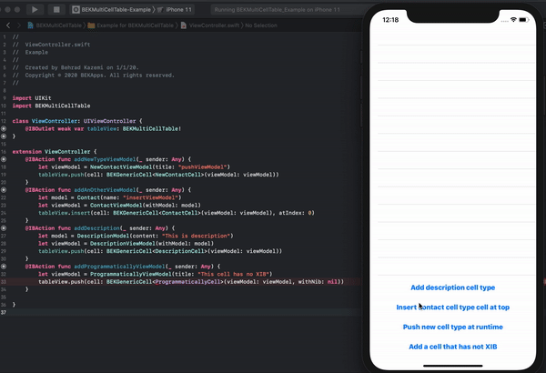

# BEKMultiCellTable
A generic table view based on MVVM that allows you to add multiple cell types at runtime in a single line of code.


[](https://travis-ci.org/popwarsweet/JellySlider)
[](http://cocoapods.org/pods/JellySlider)
[](http://cocoapods.org/pods/JellySlider)

 It doesn't need to implement the UITableViewDataSource inside your table view class. It also compatible with XIB contain cells or the programmatically implemented cells.
## Demo


## Example

__usage:__

__Table Configuration:__

Set BEKMultiCellTable to the table's class.

```swift

    @IBOutlet weak var tableView: BEKMultiCellTable!

```

__TableCell Configuration:__
Make your custom cell confirms the BEKBindableCell protocol.

```swift

  extension MyCustomCell: BEKBindableCell {    
    typealias ViewModeltype = NewContactViewModel
    func bindData(withViewModel viewModel: NewContactViewModel) {
        titleLabel.text = viewModel.nameText
        profileImage.image = viewModel.profileImage
        newProfileImage.image = viewModel.extraImage
    }
}

```

__Create and push BEKGenericCell:__

Create a BEKGenericCell with a UITableView base Class and pass it's viewModel.
```swift

  tableView.push(cell: BEKGenericCell<MyCustomCell>(viewModel: viewModel))

```
__note:__

If your table view cell hasn't XIB file just pass nil as the nib parameter.

```swift

  tableView.push(cell: BEKGenericCell<MyCustomCell>(viewModel: viewModel, withNib: nil))

```
this will register your class agaist nib to the table.

## Installation
```

  pod 'BEKMultiCellTable', :git => 'https://github.com/behrad-kzm/BEKMultiCellTable.git'

```


## Author
Behrad Kazemi, Behradkzm@gmail.com, bekapps.com
<a href="https://bekapps.com"> Visit Web Site </a>
## License

BEKCurveTabbar is available under the MIT license. See the LICENSE file for more info.
